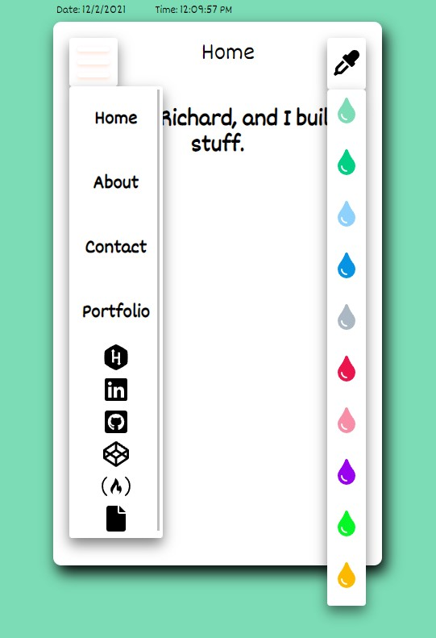
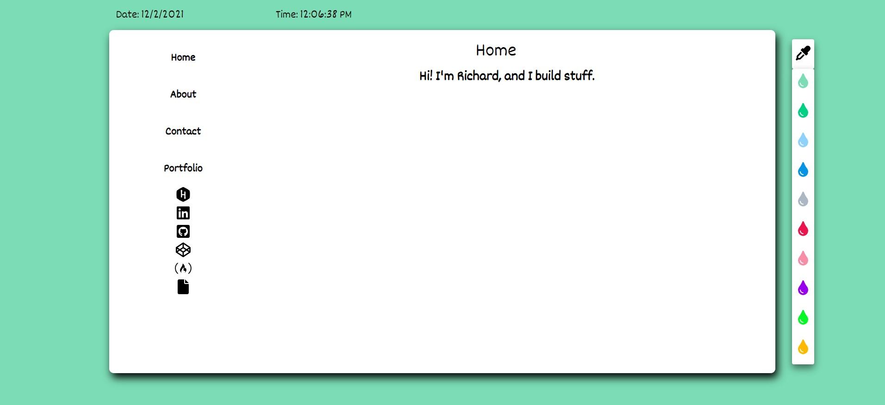

# Mobile Responsive Personal Portfolio

## Description
A personal portfolio of my work as a developer. The Front End was created with node.js to run JavaScript outside the browser, or from the command line, npm to allow us to easily install packages for our front end, and a generator to quickly and easily get our React app off the ground; Create React App. React Router, URL Parameters, and Switch are used for navigation between pages. Each pages is comprised of various components, several of which utilize the React Hooks useState, and useEffect. Background changes are powered by useState, and localStorage is used to capture the value of your selection, store it, and persist it as you navigate from one page to another, through a conditional statement wrapped in a useEffect. 

A node.js, along with express.js are used on the Back End. We skip over installing body-parser to allow our server to extract JSON data that we send in our requests, because the most recent version of express.js includes body-parser, meaning there is no need to install it. Postman is used to test our routes, nodemon is used to restart our server as its being built, and data is persisted in a non-relational, MongoDB database, as it lends itself well to relatively unstructured, JSON JavaScript requests. Mongoose.js allows us to connect to our local database, ReactStrap was used for the project cards, fontawesome is used for icons, and the entire build is hosted by Heroku.

A custom built hamburger menu is included on narrow viewports, with hover classes for the nav links, translate and transform css properties to animate this menu, and custom box-shadows.

**[Check it out Here!](https://sleepy-reaches-69699.herokuapp.com/)**

## Table of Contents
* [Installation](#installation)
* [Usage](#usage)
* [License](#usage)
* [Contributing](#contributing)
* [Tests](#tests)
* [Questions](#questions)

## Installation
1. From GitHub, fork the repository, and run npm install from the root directory. 
2. Then, from the client directory, run npm install for the front end packages. 
3. From there, run npm start from your local machine to run the code locally.

## Usage
Visit on desktop, or mobile. This app is fully responsive.

* **Responsive**  

* **Desktop**  

## Credits
Here are a few resources that helped me get this project knocked out!
* [bootstrap](https://getbootstrap.com/docs/5.0/getting-started/introduction/)
* [stackoverflow](https://stackoverflow.com/users/story/14695569)
* [Dev Ed](https://www.youtube.com/watch?v=gXkqy0b4M5g&t=3s)
* [CSS Tricks](https://css-tricks.com/a-guide-to-the-responsive-images-syntax-in-html/#using-srcset)
* [Night Sky Gaming](https://www.facebook.com/N%C4%ABght-Sk%C3%BF-Gaming-105017864808391/)
* [stockoverflow downloadable PDF file](https://stackoverflow.com/questions/364946/how-to-make-pdf-file-downloadable-in-html-link)
* [Yousef Ahmed](https://medium.com/create-a-clocking-in-system-on-react/create-a-react-app-displaying-the-current-date-and-time-using-hooks-21d946971556)
* [w3schools Dropdown tutorial](https://www.w3schools.com/howto/howto_js_dropdown.asp)
* [web dev simplified CSS dropdowns](https://www.youtube.com/watch?v=S-VeYcOCFZw)
* [DEV](https://dev.to/ceceliacreates/inline-styling-with-jsx-20k0)
* [w3schools positioning](https://www.w3schools.com/css/css_positioning.asp)
* [react-color](https://casesandberg.github.io/react-color/)
* [upmostly](https://upmostly.com/tutorials/changing-the-background-color-in-react)
* [w3schools css align](https://www.w3schools.com/css/css_align.asp)
* [Font Awesome](https://fontawesome.com/v6.0/icons?q=resume&s=solid%2Cbrands)
* [teamtreehouse Using Local Storage](https://teamtreehouse.com/library/using-local-storage)
* [reactstrap](https://reactstrap.github.io/?path=/docs/home-installation--page)
* [icons8](https://icons8.com/icons/set/express)
* [devicon](https://devicon.dev/)
* [MDN CSS Grid](https://developer.mozilla.org/en-US/docs/Web/CSS/CSS_Grid_Layout)
* [MDN async await](https://developer.mozilla.org/en-US/docs/Learn/JavaScript/Asynchronous/Async_await)
* [MDN using fetch](https://developer.mozilla.org/en-US/docs/Web/API/Fetch_API/Using_Fetch)
* [The Coding Train, HTTP Post Request with fetch](https://www.youtube.com/watch?v=Kw5tC5nQMRY&t=6s)
* [Integromat](https://www.integromat.com/scenario/2817866/edit#)
* [icons8](https://icons8.com/icons)
* [uwwing](https://uxwing.com/?s=)

## License
* Link for more information: (https://opensource.org/licenses/MIT)
* MIT License

      Copyright (c) [year] [fullname]
      
      Permission is hereby granted, free of charge, to any person obtaining a copy
      of this software and associated documentation files (the "Software"), to deal
      in the Software without restriction, including without limitation the rights
      to use, copy, modify, merge, publish, distribute, sublicense, and/or sell
      copies of the Software, and to permit persons to whom the Software is
      furnished to do so, subject to the following conditions:
      
      The above copyright notice and this permission notice shall be included in all
      copies or substantial portions of the Software.
      
      THE SOFTWARE IS PROVIDED "AS IS", WITHOUT WARRANTY OF ANY KIND, EXPRESS OR
      IMPLIED, INCLUDING BUT NOT LIMITED TO THE WARRANTIES OF MERCHANTABILITY,
      FITNESS FOR A PARTICULAR PURPOSE AND NONINFRINGEMENT. IN NO EVENT SHALL THE
      AUTHORS OR COPYRIGHT HOLDERS BE LIABLE FOR ANY CLAIM, DAMAGES OR OTHER
      LIABILITY, WHETHER IN AN ACTION OF CONTRACT, TORT OR OTHERWISE, ARISING FROM,
      OUT OF OR IN CONNECTION WITH THE SOFTWARE OR THE USE OR OTHER DEALINGS IN THE
      SOFTWARE.

## Contributing
No contributions

## Tests
N/A

## Questions
* Questions? Visit my GitHub: [raseward14](https://github.com/raseward14) 
* With additional questions, feel free to email me at: raseward14@gmail.com
