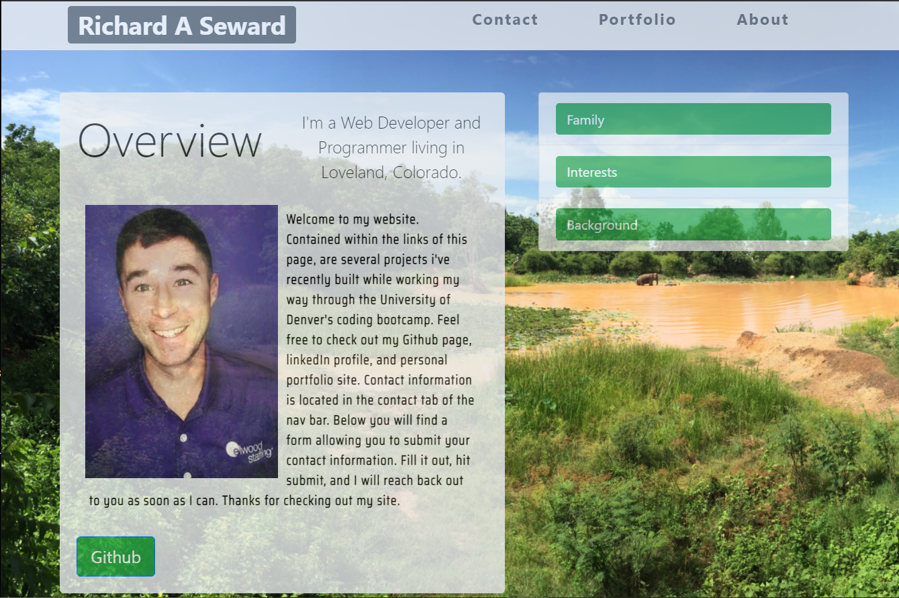
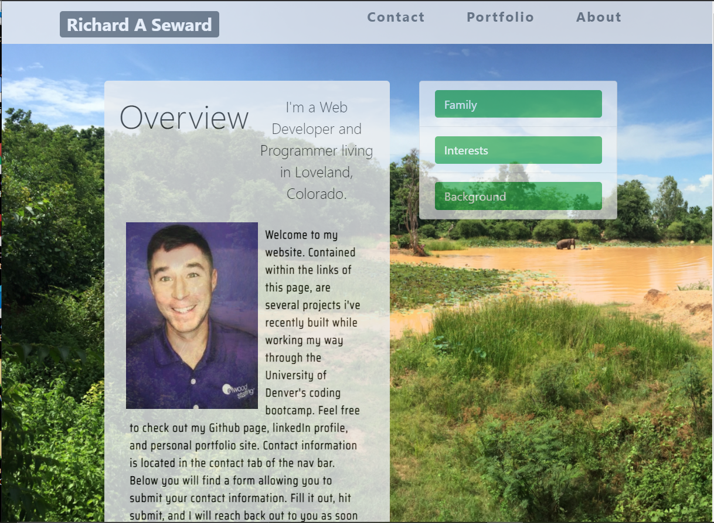
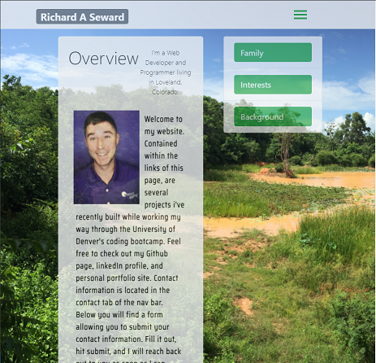
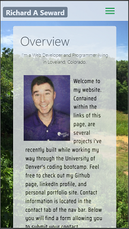

# Mobile Responsiveness Bootstrap Webpage
## Description
This webpage is designed to be my personal portfolio. It gives basic information about me, my contact information, a means of getting in contact with me, and links to projects i've worked on in the past. It utilizes HTML as the framework, and Bootstrap CSS for design. The portfolio page integrates basic Javascript, linked to Bootstrap. I had a tough time figuring out how to link my HTML document to Bootstraps Javascript features, but managed to find the link after exploring Bootstrap a bit more.

All of the Bootstrap features come from version 4.5. This is the version we spent the most time on in class, and its the version I am most familiar with.
**[Check it out Here!](https://sleepy-reaches-69699.herokuapp.com/)**

The remaining challenges came from creating and formatting the hamburger menu needed for Mobile Responsiveness. I included several breakpoints to increase responsiveness; one at 1100px, another at 1000px, and two form mobile devices; one at 768px and another at 415px (both of which utilize the hamburger menu for navigation).

## Table of Contents
* [Installation](#installation)
* [Usage](#usage)
* [Credits](#credits)
* [License](#license)

## Installation
1. Visit [getbootstrap.com](https://getbootstrap.com/)
2. Use this website to utilize CSS and Javascript in your webpage

## Usage
* **Laptop and up 1100px.**  

* **iPad 1000px.**  

* **Mobile 768px.**  

* **iPhone6 360px.**  

## Credits
Here are a few resources that helped me get this project knocked out!
* [bootstrap](https://getbootstrap.com/docs/5.0/getting-started/introduction/)
* [stackoverflow](https://stackoverflow.com/users/story/14695569)
* [Dev Ed](https://www.youtube.com/watch?v=gXkqy0b4M5g&t=3s)
* [CSS Tricks](https://css-tricks.com/a-guide-to-the-responsive-images-syntax-in-html/#using-srcset)
* [Night Sky Gaming](https://www.facebook.com/N%C4%ABght-Sk%C3%BF-Gaming-105017864808391/)
* [stockoverflow downloadable PDF file](https://stackoverflow.com/questions/364946/how-to-make-pdf-file-downloadable-in-html-link)
* [Yousef Ahmed](https://medium.com/create-a-clocking-in-system-on-react/create-a-react-app-displaying-the-current-date-and-time-using-hooks-21d946971556)
* [w3 Schools Dropdown tutorial](https://www.w3schools.com/howto/howto_js_dropdown.asp)
* [web dev simplified CSS dropdowns] (https://www.youtube.com/watch?v=S-VeYcOCFZw)

## License
©2021 Richard Seward. All Rights Reserved.
